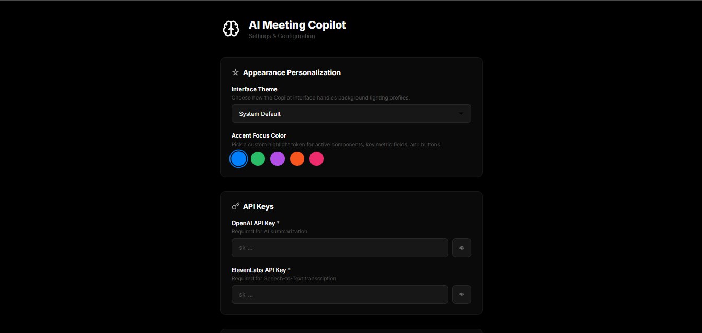

# API Key Setup

Late Meet uses a Bring Your Own Key model. Users provide their own provider keys, which keeps account ownership and usage control with the user.

## Required Keys

| Provider   | Purpose                                                  |
| ---------- | -------------------------------------------------------- |
| ElevenLabs | Speech-to-text transcription through Scribe              |
| OpenAI     | Meeting summaries, insights, decisions, and action items |

## Setup Flow

## Step-by-Step Tutorial

1. Load the extension in Chrome.
2. Open the Late Meet popup.
3. Open the API/settings screen.
4. Paste your OpenAI API key.
5. Paste your ElevenLabs API key if your setup requires ElevenLabs transcription.
6. Save the configuration.
7. Join a Google Meet call.
8. Start Copilot and open the dashboard.

## Provider Checklist

| Check                            | Why it matters                                                                   |
| -------------------------------- | -------------------------------------------------------------------------------- |
| Key is active                    | Disabled or deleted keys cannot process requests.                                |
| Billing or quota is available    | Provider calls can fail when credits, billing, or quota are missing.             |
| No extra spaces were pasted      | Leading or trailing spaces can make a valid key fail validation.                 |
| Correct provider field is used   | OpenAI and ElevenLabs keys are not interchangeable.                              |
| Key is saved before joining Meet | Copilot needs provider configuration before live meeting intelligence can start. |

## ElevenLabs Key Setup

Use your ElevenLabs key for speech-to-text transcription. Confirm the key is active in your ElevenLabs dashboard and has enough quota for meeting audio processing.

## OpenAI Key Setup

Use your OpenAI key for summaries, decisions, topics, action items, and other meeting intelligence. Confirm the key is active in your OpenAI dashboard and has enough quota for the model configured by the extension.

## Security Rules

- Never commit API keys.
- Never share API keys in screenshots.
- Never paste API keys into GitHub issues or PR descriptions.
- Rotate keys if they are exposed.
- Use provider dashboards to monitor usage.

## Safe Demo Recording

When recording screenshots, GIFs, or videos:

- Keep key fields hidden or redacted.
- Do not click reveal/eye icons while recording.
- Do not paste keys from a visible notes app or browser tab.
- Use demo-safe placeholder text only when you are not saving the value.
- Rewatch media before committing to confirm no secret, email, meeting code, or private transcript appears.

## Local Storage

Late Meet stores configuration through Chrome extension storage. This keeps setup local to the browser profile and avoids a project-managed backend database.

## Provider Usage

When meeting intelligence is active, audio transcription and summarization requests may be sent to the configured providers. Review each provider's privacy and retention settings before using real meeting data.

## Troubleshooting

| Problem                              | What to check                                                                  |
| ------------------------------------ | ------------------------------------------------------------------------------ |
| Key is rejected as invalid           | Confirm the key was copied completely and has no extra spaces.                 |
| Key saves but Copilot does not start | Reload the extension, refresh Google Meet, and check service worker logs.      |
| Transcription does not start         | Confirm the ElevenLabs key is valid and quota is available.                    |
| Summaries do not appear              | Confirm the OpenAI key is valid and the account has usable quota.              |
| Provider errors appear in logs       | Check provider dashboard status, billing, model access, and rate limits.       |
| Demo recording shows a key           | Delete the media, rotate the exposed key, and record again with fields hidden. |

For broader setup issues, see [Troubleshooting](TROUBLESHOOTING.md).
