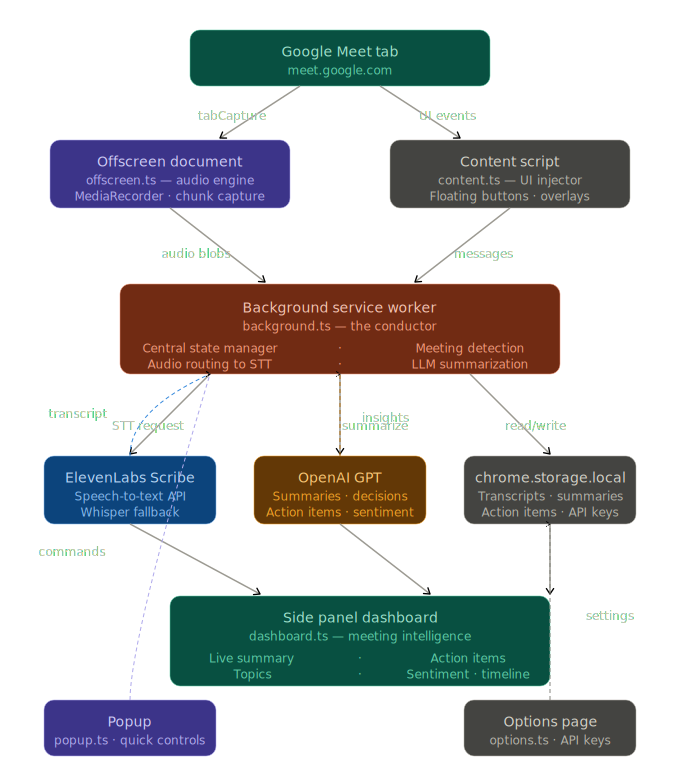

# Architecture

Late Meet is a **Manifest V3 Chrome Extension** built with TypeScript and Vite 5. It captures meeting audio directly from the browser tab, transcribes it using AI, and presents real-time intelligence through a side panel dashboard — all without adding bots to your call.

## High-Level Overview



> 🖱️ [Open interactive diagram →](https://htmlpreview.github.io/?https://github.com/shouri123/Late-Meet/blob/main/docs/assets/architecture.html)

<!--
```
┌─────────────────────────────────────────────────────────┐
│                    Google Meet Tab                       │
│                  (meet.google.com)                       │
└──────────────┬──────────────────────────────────────────┘
               │ Audio stream via chrome.tabCapture
               ▼
┌──────────────────────────┐    ┌─────────────────────────┐
│   Offscreen Document     │    │    Content Script        │
│   (offscreen.ts)         │    │    (content.ts)          │
│                          │    │                          │
│  • Audio chunk capture   │    │  • Floating UI buttons   │
│  • MediaRecorder API     │    │  • Late-joiner overlays  │
│  • Stream processing     │    │  • Chat automation       │
└──────────┬───────────────┘    └──────────┬──────────────┘
           │ Audio blobs                   │ UI events
           ▼                               ▼
┌─────────────────────────────────────────────────────────┐
│              Background Service Worker                   │
│              (background.ts — The Conductor)             │
│                                                          │
│  • Central state manager        • Meeting detection      │
│  • Audio routing to STT APIs    • Participant tracking   │
│  • LLM summarization calls      • Late-joiner briefings  │
│  • Session lifecycle mgmt       • Message coordination   │
└──────┬───────────────┬──────────────────┬───────────────┘
       │               │                  │
       ▼               ▼                  ▼
┌──────────┐   ┌──────────────┐   ┌──────────────────────┐
│ElevenLabs│   │   OpenAI     │   │ chrome.storage.local  │
│ Scribe   │   │   GPT API   │   │                       │
│ STT API  │   │              │   │  • Transcripts        │
│          │   │  • Summaries │   │  • Summaries          │
│ Fallback:│   │  • Insights  │   │  • Action items       │
│ Whisper  │   │  • Actions   │   │  • API keys           │
└──────────┘   └──────────────┘   └──────────────────────┘
                                          │
                                          ▼
                                  ┌──────────────────┐
                                  │  Side Panel UI   │
                                  │  (dashboard.ts)  │
                                  │                  │
                                  │  • Live summary  │
                                  │  • Topics        │
                                  │  • Action items  │
                                  │  • Sentiment     │
                                  │  • Timeline      │
                                  └──────────────────┘
``` -->

## Core Components

| Component                     | File(s)                                           | Responsibility                                                                                                                                                    |
| ----------------------------- | ------------------------------------------------- | ----------------------------------------------------------------------------------------------------------------------------------------------------------------- |
| **Background Service Worker** | `background.ts`                                   | Central state machine. Detects Meet tabs, routes audio to STT APIs, coordinates LLM summarization, manages session lifecycle, and handles participant tracking.   |
| **Offscreen Audio Engine**    | `offscreen.ts`, `offscreen.html`                  | Runs a hidden offscreen document for `chrome.tabCapture`. Captures audio via `MediaRecorder`, processes chunks, and forwards blobs to the background worker.      |
| **Content Script**            | `content.ts`, `content.css`                       | Injects floating UI elements into Google Meet pages. Handles the "Start Copilot" button, late-joiner briefing overlays, and chat automation for welcome messages. |
| **Side Panel Dashboard**      | `dashboard.ts`, `dashboard.html`, `dashboard.css` | Real-time intelligence display. Shows live summary, topics, decisions, action items, sentiment analysis, and meeting timeline.                                    |
| **Popup**                     | `popup.ts`, `popup.html`, `popup.css`             | Quick-access extension controls. Start/stop copilot, view meeting status, navigate to dashboard.                                                                  |
| **Options Page**              | `options.ts`, `options.html`, `options.css`       | API key configuration. Users enter their ElevenLabs and OpenAI keys (BYOK model).                                                                                 |
| **Audio Processing**          | `audioProcessing.ts`                              | Utility functions for audio format handling and MIME type detection.                                                                                              |
| **Type Definitions**          | `types.ts`                                        | TypeScript interfaces for meeting state, participants, timeline entries, etc.                                                                                     |

## Data Flow

```
1. User joins Google Meet
2. Content script detects meeting → injects "Start Copilot" button
3. User clicks Start → popup/content sends message to background
4. Background creates offscreen document with tabCapture stream
5. Offscreen captures audio chunks (MediaRecorder → blobs)
6. Background receives blobs → sends to ElevenLabs Scribe (or Whisper fallback)
7. Transcribed text returned → appended to rolling transcript window
8. Background periodically sends transcript to OpenAI GPT for:
   - Summary generation
   - Topic extraction
   - Decision detection
   - Action item identification
   - Sentiment analysis
9. Structured results stored in chrome.storage.local
10. Side panel dashboard polls storage → renders live updates
11. On meeting end → user chooses Save or Discard
```

## Privacy Model

- **BYOK**: Users supply their own API keys. No shared credentials.
- **Local-only storage**: All data lives in `chrome.storage.local`. Zero cloud sync.
- **No telemetry**: No analytics, no tracking, no usage data collection.
- **Invisible**: No bot participant added to the meeting. Audio captured via Chrome's native `tabCapture` API.
- **User-controlled lifecycle**: Data can be discarded at any time.

## Technology Stack

| Category           | Technology                                                |
| ------------------ | --------------------------------------------------------- |
| Extension Platform | Chrome Manifest V3                                        |
| Language           | TypeScript                                                |
| Build Tool         | Vite 5 with `@crxjs/vite-plugin`                          |
| Styling            | Vanilla CSS (monochrome design system)                    |
| Storage            | `chrome.storage.local`                                    |
| Transcription      | ElevenLabs Scribe v2 (primary), OpenAI Whisper (fallback) |
| Summarization      | OpenAI GPT models (configurable)                          |
| Audio Capture      | Chrome `tabCapture` + Offscreen Documents API             |
