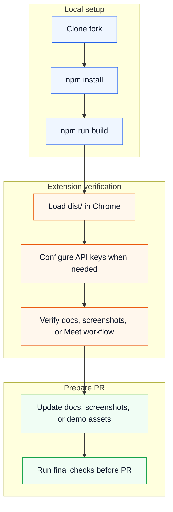

# Contributor Guide

This guide helps new contributors understand the expected workflow for Late Meet documentation and extension contributions.

For the full contribution rules, assignment process, code style, and PR expectations, read the root [CONTRIBUTING.md](../CONTRIBUTING.md). This page is a quick onboarding guide for contributors working on documentation, screenshots, demos, and focused extension updates.

## Contribution Flow

1. Find or request an assigned issue.
2. Fork the repository.
3. Create a focused branch.
4. Make scoped changes.
5. Run the relevant checks.
6. Commit with a clear message.
7. Open a PR against the main repository.

```mermaid
flowchart LR
    issue["Assigned issue"] --> fork["Fork repository"]
    fork --> branch["Create focused branch"]

    subgraph Work["Build the change"]
        changes["Make scoped changes"] --> checks["Run relevant checks"]
        checks --> commit["Commit clearly"]
    end

    subgraph Review["Share for review"]
        pr["Open pull request"] --> review["Respond to feedback"]
    end

    branch --> changes
    commit --> pr

    classDef start fill:#ecfeff,stroke:#0891b2,color:#0f172a
    classDef work fill:#f8fafc,stroke:#64748b,color:#0f172a
    classDef review fill:#f0fdf4,stroke:#16a34a,color:#0f172a
    class issue,fork,branch start
    class changes,checks,commit work
    class pr,review review
```



## Branch Naming

Use descriptive branch names:

```text
docs/premium-documentation-experience
fix/options-save-settings
feat/live-duration-timer
```

## Local Setup

```bash
npm install
npm run build
```

For code changes, also run the checks documented in the root README and [Testing Guide](../TESTING.md).



## Documentation PR Checklist

- Update the existing root README when changing homepage documentation.
- Add new docs under `docs/` when the topic needs more detail.
- Link new docs from the README.
- Use screenshots only when they improve onboarding.
- Redact private data from screenshots.
- Keep PR scope clear and reviewable.

## Screenshot Contributions

Follow [Screenshot Guide](SCREENSHOT_GUIDE.md) before adding visual assets.

## PR Description Template

```markdown
## Summary

- What changed?
- Why is it useful?

## Changes

- Key file or documentation updates

## Testing

- Commands run
- Manual verification performed
```

## Good First Documentation Areas

- Setup clarity.
- Troubleshooting notes.
- Screenshot updates.
- FAQ additions.
- Glossary improvements.
- Architecture explanations for beginners.

## Review Etiquette

- Keep discussion focused on the assigned issue.
- Respond to review comments with specific changes.
- Avoid mixing unrelated source changes into documentation PRs.
- If the scope grows, confirm with maintainers before expanding further.
