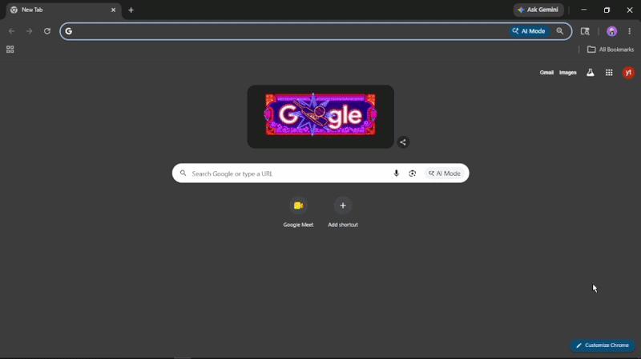

# Demo Assets

This page tracks video and GIF demo media for Late Meet.

## Planned Demo Coverage

- Full workflow video
- Short GIF demonstrations
- Quick start walkthrough video
- Feature showcase animations

## Recommended Workflow Demo

The committed GIF gives contributors a fast visual preview of the product flow. A longer full workflow video can be attached to the PR or issue when maintainers want full-length media without increasing repository size.

The main workflow demo should show:

1. Loading the Late Meet Chrome extension from `chrome://extensions`
2. Opening the extension popup
3. Opening the options/API settings page
4. Configuring settings without exposing real API keys
5. Opening Google Meet
6. Starting the Copilot overlay
7. Viewing the side panel dashboard

## Coverage Matrix

| Requested area                 | Current coverage                                                                                                                                                        |
| ------------------------------ | ----------------------------------------------------------------------------------------------------------------------------------------------------------------------- |
| Full workflow video            | Repository-safe coverage is provided by the workflow GIF preview; a full MP4 can be attached to the PR or issue if maintainers request full-length video media.         |
| Short GIF demonstrations       | Covered by `assets/demo/late-meet-workflow.gif`.                                                                                                                        |
| Quick start walkthrough        | Covered by the GIF, [Getting Started](GETTING_STARTED.md), and [Workflow Guide](WORKFLOW.md).                                                                           |
| Feature showcase animations    | Covered by the workflow GIF and screenshot-backed product preview.                                                                                                      |
| Dashboard usage                | Covered by the GIF, dashboard screenshot, and workflow guide.                                                                                                           |
| API key setup                  | Covered by the options screenshot and [API Key Setup](API_KEYS.md).                                                                                                     |
| Google Meet overlay            | Covered by the Meet overlay screenshot and workflow guide.                                                                                                              |
| Live transcription             | Covered in [Workflow Guide](WORKFLOW.md), [Troubleshooting](TROUBLESHOOTING.md), and [Testing Guide](../TESTING.md); future media can add a focused transcription clip. |
| Catch-up workflows             | Covered in README feature descriptions, [Workflow Guide](WORKFLOW.md), and architecture docs.                                                                           |
| Summary generation             | Covered in [Workflow Guide](WORKFLOW.md), dashboard screenshot, and architecture docs.                                                                                  |
| Summary/live intelligence flow | Covered in workflow documentation; future media can add a longer live transcription and summary-generation clip.                                                        |

## Full Video Storyboard

Use this storyboard when recording a full-length walkthrough:

1. Start on `chrome://extensions` with Late Meet loaded.
2. Open the extension popup.
3. Show the API configuration entry point without exposing real keys.
4. Join a Google Meet session.
5. Start Copilot from the in-meeting overlay.
6. Show live transcription or meeting intelligence beginning.
7. Open the side panel dashboard.
8. Show catch-up context, live summaries, decisions, and action items.
9. End by showing export or review controls.

## Focused Media Checklist

- Live transcription clip: show capture status and transcript updates without private meeting content.
- Catch-up clip: show the late-joiner briefing entry point and resulting summary state.
- Summary generation clip: show dashboard summary, decisions, and action items with demo-safe text.
- Settings clip: show provider setup with redacted keys.

## Short GIF Ideas

- Extension loading and popup opening
- API/options setup with redacted or demo values
- Google Meet Start Copilot overlay
- Meeting intelligence side panel dashboard

## Media Notes

Large videos should be uploaded to the PR or issue as GitHub user attachments instead of being committed directly to the repository.

Small optimized GIFs may be added under `docs/assets/demo/` if they stay under 5-10 MB.

Before publishing any media, redact meeting codes, private names, emails, API keys, transcripts, summaries, and other sensitive meeting content.
