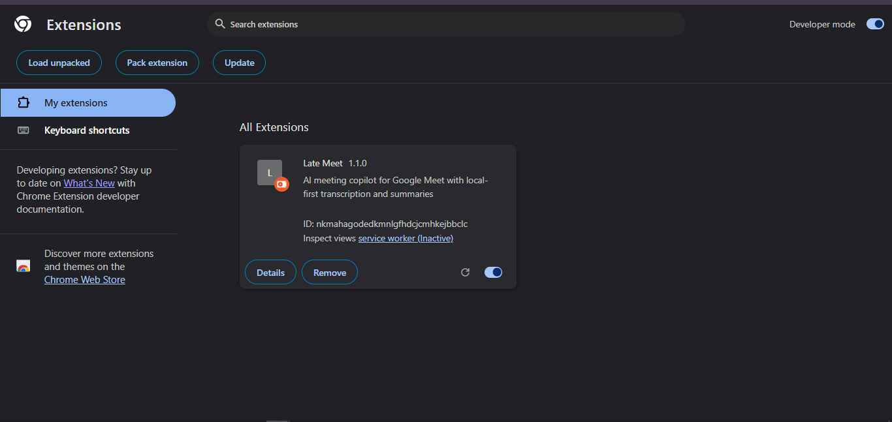
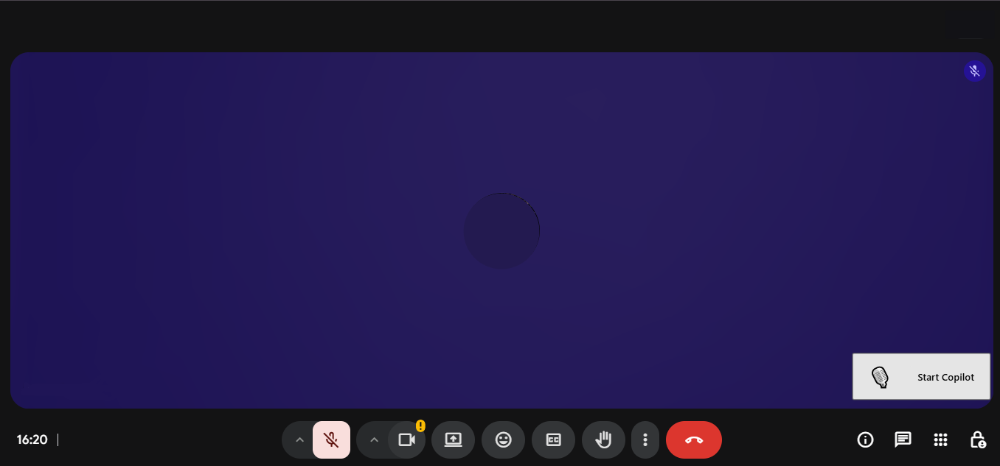
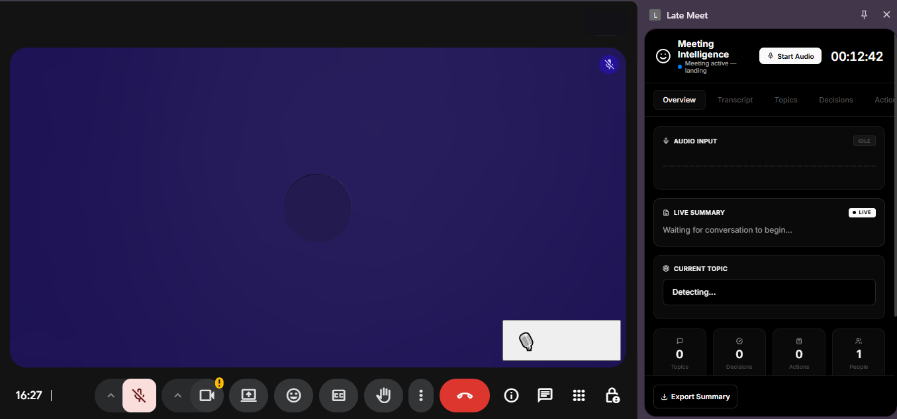

# Getting Started with Late Meet

This guide walks through the first successful local setup, from cloning the repository to running Late Meet inside Google Meet.

## Prerequisites

- Google Chrome 116 or newer for Side Panel support.
- Node.js 18 or newer.
- npm.
- An ElevenLabs API key for speech-to-text.
- An OpenAI API key for meeting intelligence and summaries.

## 1. Clone and Install

```bash
git clone https://github.com/shouri123/Late-Meet.git
cd Late-Meet
npm install
```

## 2. Build the Extension

```bash
npm run build
```

The build output is generated in the `dist/` folder. Chrome should load this folder, not the project root and not `src/`.

## 3. Load Late Meet in Chrome

1. Open `chrome://extensions/`.
2. Enable Developer mode.
3. Select Load unpacked.
4. Choose the generated `dist/` folder.

After loading, Late Meet should appear on the extensions page.



## 4. Configure API Keys

1. Pin or open the Late Meet extension from the Chrome toolbar.
2. Open the Options page.
3. Add your ElevenLabs API key.
4. Add your OpenAI API key.
5. Save the settings.


Late Meet follows a Bring Your Own Key model. Keep API keys private and never commit them to the repository.

## 5. Start Your First Meeting

1. Join a Google Meet call.
2. Wait for the Late Meet overlay to appear.
3. Click Start Copilot.
4. Open the side panel dashboard for live meeting intelligence.



## 6. Verify the Dashboard

The dashboard should show meeting status, audio state, live summary, topics, decisions, action items, and export controls.



## First-Run Checklist

- `npm install` completed successfully.
- `npm run build` generated `dist/`.
- Chrome loaded the `dist/` folder.
- API keys were saved from the options page.
- The Start Copilot overlay appeared in Google Meet.
- The side panel opened and showed the meeting dashboard.

## Next Guides

- [API Key Setup](API_KEYS.md)
- [Workflow Guide](WORKFLOW.md)
- [Troubleshooting](TROUBLESHOOTING.md)
- [Privacy](PRIVACY.md)
