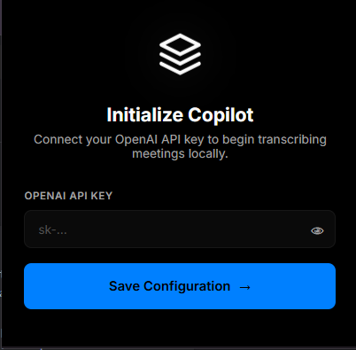

# Screenshot Guide

Screenshots make Late Meet easier to understand, but they must be consistent, useful, and privacy-safe.

## Storage Location

Store documentation screenshots in:

```text
docs/assets/screenshots/
```

Use descriptive kebab-case filenames:

```text
extension-loaded.png
popup.png
options.png
meet-start-copilot.png
dashboard-side-panel.png
late-joiner-briefing.png
live-summary.png
settings-page.png
```

## Current Screenshot Coverage

| Requested screenshot   | Current asset              | Status                        |
| ---------------------- | -------------------------- | ----------------------------- |
| Dashboard UI           | `dashboard-side-panel.png` | Covered                       |
| Extension popup        | `popup.png`                | Covered                       |
| Options page           | `options.png`              | Covered                       |
| Meeting overlays       | `meet-start-copilot.png`   | Covered                       |
| Settings pages         | `options.png`              | Covered as API/settings setup |
| Side panel workflow    | `dashboard-side-panel.png` | Covered                       |
| Late joiner experience | `late-joiner-briefing.png` | Recommended future capture    |
| Live summaries         | `live-summary.png`         | Recommended future capture    |

## Required Standards

- Capture real extension states, not empty mockups.
- Keep browser zoom consistent.
- Prefer clean, readable screenshots.
- Use meaningful alt text in Markdown.
- Redact private data before committing.
- Do not include API keys, meeting codes, private names, emails, or sensitive meeting content.

## Professional Styling Standards

- Use the same browser theme for related screenshots.
- Capture at a consistent viewport size when possible, such as 1440x900 for desktop documentation.
- Keep Chrome zoom at 100%.
- Leave enough margin around popups, overlays, and side panels so the UI does not feel cropped.
- Prefer light browser chrome with a clean page background unless the product UI requires otherwise.
- Use crisp PNG files for static screenshots.
- Avoid compression artifacts, blurry captures, and inconsistent scaling.

## Device Frames

Device frames are optional, but they can make hero or README screenshots feel more polished.

Use frames when:

- Showing a primary product preview.
- Comparing popup, options, overlay, and dashboard states.
- Creating a documentation hero image or social preview.

Avoid frames when:

- The screenshot is used for debugging.
- The frame hides important browser extension details.
- The added decoration makes small UI text harder to read.

If frames are used, keep them consistent across the full screenshot set.

## Annotated Feature Highlights

Annotations should explain one feature at a time without covering important UI.

Recommended annotation style:

- Short labels with 2-5 words.
- Thin lines or subtle callouts.
- High contrast text.
- No arrows pointing at private data.
- No overlapping labels.

Useful annotation targets:

- API key setup field.
- Start Copilot overlay.
- Dashboard summary area.
- Action items section.
- Export controls.
- Local-first privacy indicator, when visible.

## Redaction Checklist

Before committing a screenshot, check for:

- Meeting code.
- Meeting title.
- User avatar.
- User name.
- Email address.
- API keys.
- Private chat messages.
- Confidential transcript or summary text.

## README Usage

Use Markdown image syntax with relative paths:

```markdown

```

For screenshots inside files under `docs/`, use paths relative to the docs file:

```markdown

```

## Review Checklist

- Image path resolves locally.
- Alt text describes the UI state.
- Screenshot is not blurry.
- Sensitive data is removed.
- Filename matches the documented UI state.
- Screenshot style matches the rest of the documentation set.
- Annotations, if present, do not hide controls or private data.
- Device frames, if present, are consistent and do not reduce readability.
